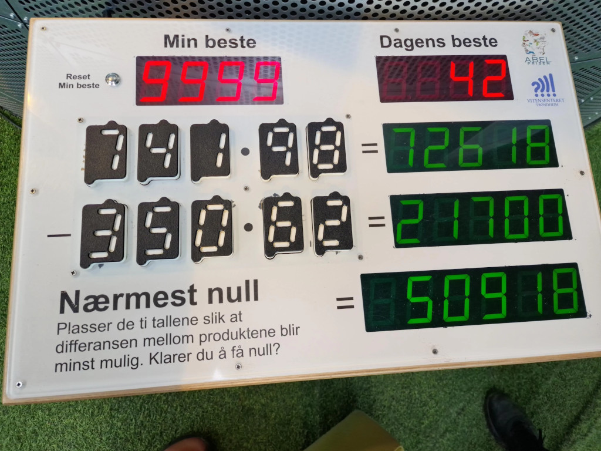

# Introduction



Can you place all 10 digits `0`, `1`, `2` through `9` inclusive, with no repeats, in the blanks `_` to minimize the sum for this puzzle?

      _ _ _ * _ _ = #####

    - _ _ _ * _ _ = #####

                   ######

One solution would be:

     865 * 97 = 83905
    -432 * 10 = -4320
              = 79585

# Solver

How do we solve this?  First, let's assign some variables:

     X = a * b
     Y = c * d
     Z = X - Y

We can use a _naive_ brute force search for all numbers between \[0 ... 10,000,000,000\) and assigning them to the multiplicands & multipliers.

```
     n =  ##########
       -> aaabbcccdd
```

We can use a smarter _factoradic_ brute force search of 10! between \[0 ... 3,628,800\) HOWEVER **we need "unpack" the factoradic number to the corresponding 10 digit permutation.**

# Solutions

```
 46 * 79 =  3634   -158 * 23 =  -3634   =     0  [#46/48] 0###
 54 * 69 =  3726   -138 * 27 =  -3726   =     0  [#45/48] 0###
 54 * 93 =  5022   -186 * 27 =  -5022   =     0  [#45/48] 0###
 58 * 67 =  3886   -134 * 29 =  -3886   =     0  [#45/48] 0###
 58 * 69 =  4002   -174 * 23 =  -4002   =     0  [#45/48] 0###
 58 * 73 =  4234   -146 * 29 =  -4234   =     0  [#45/48] 0###
 58 * 96 =  5568   -174 * 32 =  -5568   =     0  [#45/48] 0###
 63 * 74 =  4662   -259 * 18 =  -4662   =     0  [#45/48] 0###
 64 * 79 =  5056   -158 * 32 =  -5056   =     0  [#45/48] 0###
 67 * 58 =  3886   -134 * 29 =  -3886   =     0  [#44/48] 0###
 69 * 54 =  3726   -138 * 27 =  -3726   =     0  [#44/48] 0###
 69 * 58 =  4002   -174 * 23 =  -4002   =     0  [#44/48] 0###
 73 * 58 =  4234   -146 * 29 =  -4234   =     0  [#44/48] 0###
 73 * 96 =  7008   -584 * 12 =  -7008   =     0  [#44/48] 0###
 74 * 63 =  4662   -259 * 18 =  -4662   =     0  [#44/48] 0###
 76 * 98 =  7448   -532 * 14 =  -7448   =     0  [#44/48] 0###
 79 * 46 =  3634   -158 * 23 =  -3634   =     0  [#44/48] 0###
 79 * 64 =  5056   -158 * 32 =  -5056   =     0  [#44/48] 0###
 93 * 54 =  5022   -186 * 27 =  -5022   =     0  [#43/48] 0###
 96 * 58 =  5568   -174 * 32 =  -5568   =     0  [#43/48] 0###
 96 * 73 =  7008   -584 * 12 =  -7008   =     0  [#43/48] 0###
 98 * 76 =  7448   -532 * 14 =  -7448   =     0  [#43/48] 0###
123 * 56 =  6888   -984 *  7 =  -6888   =     0  [#42/48] 0###
130 * 97 = 12610   -485 * 26 = -12610   =     0  [#42/48] == 0
132 * 46 =  6072   -759 *  8 =  -6072   =     0  [#42/48] 0###
134 * 29 =  3886   - 58 * 67 =  -3886   =     0  [#41/48] 0###
134 * 29 =  3886   - 67 * 58 =  -3886   =     0  [#41/48] 0###
135 * 96 = 12960   -270 * 48 = -12960   =     0  [#41/48] == 0
135 * 96 = 12960   -480 * 27 = -12960   =     0  [#41/48] == 0
136 * 27 =  3672   -459 *  8 =  -3672   =     0  [#41/48] 0###
138 * 27 =  3726   - 54 * 69 =  -3726   =     0  [#41/48] 0###
138 * 27 =  3726   - 69 * 54 =  -3726   =     0  [#41/48] 0###
138 * 90 = 12420   -276 * 45 = -12420   =     0  [#41/48] == 0
145 * 76 = 11020   -290 * 38 = -11020   =     0  [#41/48] == 0
145 * 76 = 11020   -380 * 29 = -11020   =     0  [#41/48] == 0
146 * 29 =  4234   - 58 * 73 =  -4234   =     0  [#41/48] 0###
146 * 29 =  4234   - 73 * 58 =  -4234   =     0  [#41/48] 0###
148 * 70 = 10360   -296 * 35 = -10360   =     0  [#41/48] == 0
153 * 28 =  4284   -476 *  9 =  -4284   =     0  [#40/48] 0###
153 * 46 =  7038   -782 *  9 =  -7038   =     0  [#40/48] 0###
154 * 29 =  4466   -638 *  7 =  -4466   =     0  [#40/48] 0###
156 * 23 =  3588   -897 *  4 =  -3588   =     0  [#40/48] 0###
158 * 23 =  3634   - 46 * 79 =  -3634   =     0  [#40/48] 0###
158 * 23 =  3634   - 79 * 46 =  -3634   =     0  [#40/48] 0###
158 * 32 =  5056   - 64 * 79 =  -5056   =     0  [#40/48] 0###
158 * 32 =  5056   - 79 * 64 =  -5056   =     0  [#40/48] 0###
160 * 97 = 15520   -485 * 32 = -15520   =     0  [#40/48] == 0
165 * 78 = 12870   -429 * 30 = -12870   =     0  [#40/48] == 0
170 * 94 = 15980   -235 * 68 = -15980   =     0  [#39/48] == 0
174 * 23 =  4002   - 58 * 69 =  -4002   =     0  [#39/48] 0###
174 * 23 =  4002   - 69 * 58 =  -4002   =     0  [#39/48] 0###
174 * 32 =  5568   - 58 * 96 =  -5568   =     0  [#39/48] 0###
174 * 32 =  5568   - 96 * 58 =  -5568   =     0  [#39/48] 0###
184 * 95 = 17480   -230 * 76 = -17480   =     0  [#39/48] == 0
184 * 95 = 17480   -760 * 23 = -17480   =     0  [#39/48] == 0
185 * 92 = 17020   -370 * 46 = -17020   =     0  [#39/48] == 0
185 * 92 = 17020   -460 * 37 = -17020   =     0  [#39/48] == 0
186 * 27 =  5022   - 54 * 93 =  -5022   =     0  [#39/48] 0###
186 * 27 =  5022   - 93 * 54 =  -5022   =     0  [#39/48] 0###
186 * 45 =  8370   -279 * 30 =  -8370   =     0  [#39/48] == 0
186 * 90 = 16740   -372 * 45 = -16740   =     0  [#39/48] == 0
187 * 92 = 17204   -506 * 34 = -17204   =     0  [#39/48] == 0
195 * 72 = 14040   -468 * 30 = -14040   =     0  [#38/48] == 0
195 * 84 = 16380   -273 * 60 = -16380   =     0  [#38/48] == 0
217 * 80 = 17360   -496 * 35 = -17360   =     0  [#37/48] == 0
230 * 76 = 17480   -184 * 95 = -17480   =     0  [#37/48] == 0
235 * 68 = 15980   -170 * 94 = -15980   =     0  [#37/48] == 0
235 * 68 = 15980   -940 * 17 = -15980   =     0  [#37/48] == 0
237 * 60 = 14220   -948 * 15 = -14220   =     0  [#36/48] == 0
248 * 95 = 23560   -310 * 76 = -23560   =     0  [#36/48] == 0
248 * 95 = 23560   -760 * 31 = -23560   =     0  [#36/48] == 0
259 * 18 =  4662   - 63 * 74 =  -4662   =     0  [#35/48] 0###
259 * 18 =  4662   - 74 * 63 =  -4662   =     0  [#35/48] 0###
259 * 86 = 22274   -301 * 74 = -22274   =     0  [#35/48] == 0
267 * 18 =  4806   -534 *  9 =  -4806   =     0  [#35/48] 0###
269 * 14 =  3766   -538 *  7 =  -3766   =     0  [#35/48] 0###
270 * 48 = 12960   -135 * 96 = -12960   =     0  [#35/48] == 0
270 * 63 = 17010   -945 * 18 = -17010   =     0  [#35/48] == 0
273 * 18 =  4914   -546 *  9 =  -4914   =     0  [#35/48] 0###
273 * 60 = 16380   -195 * 84 = -16380   =     0  [#35/48] == 0
276 * 45 = 12420   -138 * 90 = -12420   =     0  [#34/48] == 0
279 * 30 =  8370   -186 * 45 =  -8370   =     0  [#34/48] == 0
279 * 30 =  8370   -465 * 18 =  -8370   =     0  [#34/48] == 0
290 * 38 = 11020   -145 * 76 = -11020   =     0  [#34/48] == 0
293 * 14 =  4102   -586 *  7 =  -4102   =     0  [#33/48] 0###
296 * 35 = 10360   -148 * 70 = -10360   =     0  [#33/48] == 0
296 * 51 = 15096   -408 * 37 = -15096   =     0  [#33/48] == 0
301 * 74 = 22274   -259 * 86 = -22274   =     0  [#33/48] == 0
306 * 27 =  8262   -459 * 18 =  -8262   =     0  [#33/48] == 0
307 * 58 = 17806   -614 * 29 = -17806   =     0  [#33/48] == 0
309 * 54 = 16686   -618 * 27 = -16686   =     0  [#33/48] == 0
310 * 76 = 23560   -248 * 95 = -23560   =     0  [#33/48] == 0
310 * 97 = 30070   -485 * 62 = -30070   =     0  [#33/48] == 0
318 * 60 = 19080   -795 * 24 = -19080   =     0  [#32/48] == 0
327 * 18 =  5886   -654 *  9 =  -5886   =     0  [#32/48] 0###
328 * 95 = 31160   -410 * 76 = -31160   =     0  [#32/48] == 0
328 * 95 = 31160   -760 * 41 = -31160   =     0  [#32/48] == 0
329 * 14 =  4606   -658 *  7 =  -4606   =     0  [#32/48] 0###
345 * 26 =  8970   -897 * 10 =  -8970   =     0  [#31/48] == 0
351 * 96 = 33696   -702 * 48 = -33696   =     0  [#31/48] == 0
360 * 89 = 32040   -712 * 45 = -32040   =     0  [#30/48] == 0
360 * 91 = 32760   -728 * 45 = -32760   =     0  [#30/48] == 0
370 * 46 = 17020   -185 * 92 = -17020   =     0  [#30/48] == 0
372 * 45 = 16740   -186 * 90 = -16740   =     0  [#30/48] == 0
380 * 29 = 11020   -145 * 76 = -11020   =     0  [#29/48] == 0
381 * 90 = 34290   -762 * 45 = -34290   =     0  [#29/48] == 0
406 * 37 = 15022   -518 * 29 = -15022   =     0  [#28/48] == 0
408 * 37 = 15096   -296 * 51 = -15096   =     0  [#28/48] == 0
408 * 79 = 32232   -632 * 51 = -32232   =     0  [#28/48] == 0
408 * 92 = 37536   -736 * 51 = -37536   =     0  [#28/48] == 0
410 * 76 = 31160   -328 * 95 = -31160   =     0  [#28/48] == 0
429 * 30 = 12870   -165 * 78 = -12870   =     0  [#27/48] == 0
451 * 76 = 34276   -902 * 38 = -34276   =     0  [#26/48] == 0
459 *  8 =  3672   -136 * 27 =  -3672   =     0  [#26/48] 0###
459 * 18 =  8262   -306 * 27 =  -8262   =     0  [#26/48] == 0
460 * 37 = 17020   -185 * 92 = -17020   =     0  [#26/48] == 0
465 * 18 =  8370   -279 * 30 =  -8370   =     0  [#25/48] == 0
468 * 30 = 14040   -195 * 72 = -14040   =     0  [#25/48] == 0
476 *  9 =  4284   -153 * 28 =  -4284   =     0  [#25/48] 0###
476 * 53 = 25228   -901 * 28 = -25228   =     0  [#25/48] == 0
480 * 27 = 12960   -135 * 96 = -12960   =     0  [#25/48] == 0
481 * 70 = 33670   -962 * 35 = -33670   =     0  [#24/48] == 0
485 * 26 = 12610   -130 * 97 = -12610   =     0  [#24/48] == 0
485 * 26 = 12610   -970 * 13 = -12610   =     0  [#24/48] == 0
485 * 32 = 15520   -160 * 97 = -15520   =     0  [#24/48] == 0
485 * 32 = 15520   -970 * 16 = -15520   =     0  [#24/48] == 0
485 * 62 = 30070   -310 * 97 = -30070   =     0  [#24/48] == 0
485 * 62 = 30070   -970 * 31 = -30070   =     0  [#24/48] == 0
486 * 30 = 14580   -972 * 15 = -14580   =     0  [#24/48] == 0
496 * 35 = 17360   -217 * 80 = -17360   =     0  [#24/48] == 0
504 * 89 = 44856   -712 * 63 = -44856   =     0  [#23/48] == 0
504 * 91 = 45864   -728 * 63 = -45864   =     0  [#23/48] == 0
506 * 34 = 17204   -187 * 92 = -17204   =     0  [#23/48] == 0
518 * 29 = 15022   -406 * 37 = -15022   =     0  [#23/48] == 0
532 * 14 =  7448   - 76 * 98 =  -7448   =     0  [#22/48] 0###
532 * 14 =  7448   - 98 * 76 =  -7448   =     0  [#22/48] 0###
534 *  9 =  4806   -267 * 18 =  -4806   =     0  [#22/48] 0###
538 *  7 =  3766   -269 * 14 =  -3766   =     0  [#21/48] 0###
546 *  9 =  4914   -273 * 18 =  -4914   =     0  [#21/48] 0###
584 * 12 =  7008   - 73 * 96 =  -7008   =     0  [#19/48] 0###
584 * 12 =  7008   - 96 * 73 =  -7008   =     0  [#19/48] 0###
586 *  7 =  4102   -293 * 14 =  -4102   =     0  [#19/48] 0###
614 * 29 = 17806   -307 * 58 = -17806   =     0  [#18/48] == 0
618 * 27 = 16686   -309 * 54 = -16686   =     0  [#18/48] == 0
618 * 45 = 27810   -927 * 30 = -27810   =     0  [#18/48] == 0
630 * 27 = 17010   -945 * 18 = -17010   =     0  [#17/48] == 0
632 * 51 = 32232   -408 * 79 = -32232   =     0  [#17/48] == 0
638 *  7 =  4466   -154 * 29 =  -4466   =     0  [#17/48] 0###
654 *  9 =  5886   -327 * 18 =  -5886   =     0  [#16/48] 0###
658 *  7 =  4606   -329 * 14 =  -4606   =     0  [#16/48] 0###
702 * 48 = 33696   -351 * 96 = -33696   =     0  [#14/48] == 0
702 * 63 = 44226   -819 * 54 = -44226   =     0  [#14/48] == 0
712 * 45 = 32040   -360 * 89 = -32040   =     0  [#13/48] == 0
712 * 45 = 32040   -890 * 36 = -32040   =     0  [#13/48] == 0
712 * 63 = 44856   -504 * 89 = -44856   =     0  [#13/48] == 0
716 * 30 = 21480   -895 * 24 = -21480   =     0  [#13/48] == 0
716 * 40 = 28640   -895 * 32 = -28640   =     0  [#13/48] == 0
728 * 45 = 32760   -360 * 91 = -32760   =     0  [#12/48] == 0
728 * 45 = 32760   -910 * 36 = -32760   =     0  [#12/48] == 0
728 * 63 = 45864   -504 * 91 = -45864   =     0  [#12/48] == 0
732 * 60 = 43920   -915 * 48 = -43920   =     0  [#12/48] == 0
732 * 80 = 58560   -915 * 64 = -58560   =     0  [#12/48] == 0
736 * 51 = 37536   -408 * 92 = -37536   =     0  [#12/48] == 0
748 * 20 = 14960   -935 * 16 = -14960   =     0  [#11/48] == 0
754 * 31 = 23374   -806 * 29 = -23374   =     0  [#11/48] == 0
759 *  8 =  6072   -132 * 46 =  -6072   =     0  [#11/48] 0###
760 * 23 = 17480   -184 * 95 = -17480   =     0  [#11/48] == 0
760 * 31 = 23560   -248 * 95 = -23560   =     0  [#11/48] == 0
760 * 41 = 31160   -328 * 95 = -31160   =     0  [#11/48] == 0
762 * 45 = 34290   -381 * 90 = -34290   =     0  [#11/48] == 0
782 *  9 =  7038   -153 * 46 =  -7038   =     0  [#10/48] 0###
782 * 53 = 41446   -901 * 46 = -41446   =     0  [#10/48] == 0
795 * 24 = 19080   -318 * 60 = -19080   =     0  [# 9/48] == 0
806 * 29 = 23374   -754 * 31 = -23374   =     0  [# 9/48] == 0
819 * 54 = 44226   -702 * 63 = -44226   =     0  [# 8/48] == 0
890 * 36 = 32040   -712 * 45 = -32040   =     0  [# 5/48] == 0
895 * 24 = 21480   -716 * 30 = -21480   =     0  [# 4/48] == 0
895 * 32 = 28640   -716 * 40 = -28640   =     0  [# 4/48] == 0
897 *  4 =  3588   -156 * 23 =  -3588   =     0  [# 4/48] 0###
897 * 10 =  8970   -345 * 26 =  -8970   =     0  [# 4/48] == 0
901 * 28 = 25228   -476 * 53 = -25228   =     0  [# 4/48] == 0
901 * 46 = 41446   -782 * 53 = -41446   =     0  [# 4/48] == 0
902 * 38 = 34276   -451 * 76 = -34276   =     0  [# 4/48] == 0
910 * 36 = 32760   -728 * 45 = -32760   =     0  [# 4/48] == 0
915 * 48 = 43920   -732 * 60 = -43920   =     0  [# 3/48] == 0
915 * 64 = 58560   -732 * 80 = -58560   =     0  [# 3/48] == 0
927 * 30 = 27810   -618 * 45 = -27810   =     0  [# 3/48] == 0
935 * 16 = 14960   -748 * 20 = -14960   =     0  [# 2/48] == 0
940 * 17 = 15980   -235 * 68 = -15980   =     0  [# 2/48] == 0
945 * 18 = 17010   -270 * 63 = -17010   =     0  [# 2/48] == 0
945 * 18 = 17010   -630 * 27 = -17010   =     0  [# 2/48] == 0
948 * 15 = 14220   -237 * 60 = -14220   =     0  [# 2/48] == 0
962 * 35 = 33670   -481 * 70 = -33670   =     0  [# 1/48] == 0
970 * 13 = 12610   -485 * 26 = -12610   =     0  [# 1/48] == 0
970 * 16 = 15520   -485 * 32 = -15520   =     0  [# 1/48] == 0
970 * 31 = 30070   -485 * 62 = -30070   =     0  [# 1/48] == 0
972 * 15 = 14580   -486 * 30 = -14580   =     0  [# 0/48] == 0
984 *  7 =  6888   -123 * 56 =  -6888   =     0  [# 0/48] 0###
```

**Legend:**

* `0###` summation is zero but one of the numbers starts with zero
* `== 0` summation is zero

# Thread Scaling

Here is a thread scaling comparing the naive brute force search (10,000,000,000) vs factoradic brute force search (3,628,800):

|Threads| Naive     |Factoradic|
|------:|----------:|---------:|
|     1 | 113189 ms |   244 ms |
|     2 |  66521 ms |   129 ms |
|     4 |  35180 ms |    71 ms |
|     8 |  18115 ms |    33 ms |
|    16 |   9258 ms |    18 ms |
|    24 |   7004 ms |    14 ms |
|    32 |   6225 ms |    16 ms |
|    48 |   5001 ms |    13 ms |

# Understanding Performance

Why is the factoradic version _SO much faster_ then the naive version?

* The naive version is doing (10,000,000,000 / 3,628,800) = 2755x MORE WORK.
* The naive version is wasting time searching though 100*(1 - 10!/1e10) = 99.963712% INVALID permutations.
* The factoradic version is searching 10!/1e10 = 0.036288% of the naive search space.
* The factoradic version has 100% VALID permutations.

For example:

* Naive 0000000000 is an invalid permutation
* Naive 0000000001 is an invalid permutation
* Naive 0123456789 is the first valid permutation
* Naive 9876543210 is the last valid permutation
* Naive 9876543211 is an invalid permutation
* Naive 9999999999 is an invalid permutation

* Factoradic `      0` is the permutation 0123456789
* Factoradic `      1` is the permutation 0123456798
* Factoradic `3628798` is the permutation 9876543201
* Factoradic `3628799` os the permutation 9876543210

Putting this in table form:

| Naive      | Permutation |
|-----------:|------------:|
| 0000000000 |     invalid |
| 0000000001 |     invalid |
|          : |           : |
| 0123456788 |     invalid |
| 0123456789 |       valid |
| 0123456790 |     invalid |
|          : |           : |
|          : |           : |
| 9876543209 |     invalid |
| 9876543210 |       valid |
| 9876543211 |     invalid |
|          : |           : |
| 9999999999 |     invalid |

|Factoradic| Permtuation|
|---------:|-----------:|
|        0 |  123456789 |
|        1 |  123456798 |
|        2 |  123456879 |
|        : |          : |
|  3628797 | 9876543120 |
|  3628798 | 9876543201 |
|  3628799 | 9876543210 |

The above factoradic table was made with this snippet:

```c
    printf( "|Factoradic| Permtuation|\n" );
    printf( "|---------:|-----------:|\n" );
    for( int factoradic = 0; factoradic < 3; factoradic++ )
    {
        FactoradicConverter f( factoradic );
        int64_t n = f.nNatural;
        printf( "|  %7d | %10zd |\n", factoradic, n );
    }
    printf( "|        : |          : |\n" );
    for( int factoradic = SET_PERMUTATIONS-3; factoradic < SET_PERMUTATIONS; factoradic++ )
    {
        FactoradicConverter f( factoradic );
        int64_t n = f.nNatural;
        printf( "|  %7d | %10zd |\n", factoradic, n );
    }
```
# Doing more work per thread?

Currently we have 10! permutations to search.  This 3,628,800 total amount of work gets split up by the number of threads your CPU has.

What if each thread did more work? How should we split it up?

* Process `   2` permutations per thread?
* Process `   3` permutations per thread?
* Prcesss `   4` permtutations per thread?
* Process ` 100` permutations per thread?
* Process ` 256` permutations per thread?
* Process `1000` permutations per thread?

First, we'll disable output to make this benchmark purely CPU bound.

Next, we'll try various work per thread:

```c++
    //int nWorkPerThread = 1;
    //int nWorkPerThread = 200;
    //int nWorkPerThread = 256;
    //for( int nWorkPerThread = 100; nWorkPerThread <= 10000; nWorkPerThread += 100 )
    //for( int nWorkPerThread = 1; nWorkPerThread < 129; nWorkPerThread++ )
      for( int nWorkPerThread = 1; nWorkPerThread < 8192; nWorkPerThread *= 2 )
```

Collecting the results shows that it doesn't matter.  We are at peak utilization of cores/threads.

```
Chunk Size: 1 .. 128
  11710400 ns / 3628800 = 3 ns/factoradic, Work/Th:    1, Pages: 3628800, Last Work:    0, Time: 11 ms, 0 Sum: 198
  11319200 ns / 3628800 = 3 ns/factoradic, Work/Th:    2, Pages: 1814400, Last Work:    0, Time: 11 ms, 0 Sum: 198
  11393400 ns / 3628800 = 3 ns/factoradic, Work/Th:    3, Pages: 1209600, Last Work:    0, Time: 11 ms, 0 Sum: 198
  12128400 ns / 3628800 = 3 ns/factoradic, Work/Th:    4, Pages:  907200, Last Work:    0, Time: 12 ms, 0 Sum: 198
  11297100 ns / 3628800 = 3 ns/factoradic, Work/Th:    5, Pages:  725760, Last Work:    0, Time: 11 ms, 0 Sum: 198
  11741400 ns / 3628800 = 3 ns/factoradic, Work/Th:    6, Pages:  604800, Last Work:    0, Time: 11 ms, 0 Sum: 198
  11660300 ns / 3628800 = 3 ns/factoradic, Work/Th:    7, Pages:  518400, Last Work:    0, Time: 11 ms, 0 Sum: 198
  11663200 ns / 3628800 = 3 ns/factoradic, Work/Th:    8, Pages:  453600, Last Work:    0, Time: 11 ms, 0 Sum: 198
  11740600 ns / 3628800 = 3 ns/factoradic, Work/Th:    9, Pages:  403200, Last Work:    0, Time: 11 ms, 0 Sum: 198
  11669800 ns / 3628800 = 3 ns/factoradic, Work/Th:   10, Pages:  362880, Last Work:    0, Time: 11 ms, 0 Sum: 198
  11315400 ns / 3628800 = 3 ns/factoradic, Work/Th:   11, Pages:  329890, Last Work:   10, Time: 11 ms, 0 Sum: 198
  10825600 ns / 3628800 = 3 ns/factoradic, Work/Th:   12, Pages:  302400, Last Work:    0, Time: 10 ms, 0 Sum: 198
  11991800 ns / 3628800 = 3 ns/factoradic, Work/Th:   13, Pages:  279138, Last Work:    6, Time: 11 ms, 0 Sum: 198
  11366800 ns / 3628800 = 3 ns/factoradic, Work/Th:   14, Pages:  259200, Last Work:    0, Time: 11 ms, 0 Sum: 198
  11801200 ns / 3628800 = 3 ns/factoradic, Work/Th:   15, Pages:  241920, Last Work:    0, Time: 11 ms, 0 Sum: 198
  11748700 ns / 3628800 = 3 ns/factoradic, Work/Th:   16, Pages:  226800, Last Work:    0, Time: 11 ms, 0 Sum: 198
  11189600 ns / 3628800 = 3 ns/factoradic, Work/Th:   17, Pages:  213458, Last Work:   14, Time: 11 ms, 0 Sum: 198
  11845600 ns / 3628800 = 3 ns/factoradic, Work/Th:   18, Pages:  201600, Last Work:    0, Time: 11 ms, 0 Sum: 198
  11785500 ns / 3628800 = 3 ns/factoradic, Work/Th:   19, Pages:  190989, Last Work:    9, Time: 11 ms, 0 Sum: 198
  11268100 ns / 3628800 = 3 ns/factoradic, Work/Th:   20, Pages:  181440, Last Work:    0, Time: 11 ms, 0 Sum: 198
  12094100 ns / 3628800 = 3 ns/factoradic, Work/Th:   21, Pages:  172800, Last Work:    0, Time: 12 ms, 0 Sum: 198
  11174600 ns / 3628800 = 3 ns/factoradic, Work/Th:   22, Pages:  164945, Last Work:   10, Time: 11 ms, 0 Sum: 198
  12623200 ns / 3628800 = 3 ns/factoradic, Work/Th:   23, Pages:  157773, Last Work:   21, Time: 12 ms, 0 Sum: 198
  13150300 ns / 3628800 = 4 ns/factoradic, Work/Th:   24, Pages:  151200, Last Work:    0, Time: 13 ms, 0 Sum: 198
  14396600 ns / 3628800 = 4 ns/factoradic, Work/Th:   25, Pages:  145152, Last Work:    0, Time: 14 ms, 0 Sum: 198
  13658500 ns / 3628800 = 4 ns/factoradic, Work/Th:   26, Pages:  139569, Last Work:    6, Time: 13 ms, 0 Sum: 198
  11571000 ns / 3628800 = 3 ns/factoradic, Work/Th:   27, Pages:  134400, Last Work:    0, Time: 11 ms, 0 Sum: 198
  12411200 ns / 3628800 = 3 ns/factoradic, Work/Th:   28, Pages:  129600, Last Work:    0, Time: 12 ms, 0 Sum: 198
  11568700 ns / 3628800 = 3 ns/factoradic, Work/Th:   29, Pages:  125131, Last Work:    1, Time: 11 ms, 0 Sum: 198
  11457500 ns / 3628800 = 3 ns/factoradic, Work/Th:   30, Pages:  120960, Last Work:    0, Time: 11 ms, 0 Sum: 198
  11470900 ns / 3628800 = 3 ns/factoradic, Work/Th:   31, Pages:  117058, Last Work:    2, Time: 11 ms, 0 Sum: 198
  11176900 ns / 3628800 = 3 ns/factoradic, Work/Th:   32, Pages:  113400, Last Work:    0, Time: 11 ms, 0 Sum: 198
  12225800 ns / 3628800 = 3 ns/factoradic, Work/Th:   33, Pages:  109963, Last Work:   21, Time: 12 ms, 0 Sum: 198
  11445700 ns / 3628800 = 3 ns/factoradic, Work/Th:   34, Pages:  106729, Last Work:   14, Time: 11 ms, 0 Sum: 198
  11322000 ns / 3628800 = 3 ns/factoradic, Work/Th:   35, Pages:  103680, Last Work:    0, Time: 11 ms, 0 Sum: 198
  12280400 ns / 3628800 = 3 ns/factoradic, Work/Th:   36, Pages:  100800, Last Work:    0, Time: 12 ms, 0 Sum: 198
  11666800 ns / 3628800 = 3 ns/factoradic, Work/Th:   37, Pages:   98075, Last Work:   25, Time: 11 ms, 0 Sum: 198
  11269000 ns / 3628800 = 3 ns/factoradic, Work/Th:   38, Pages:   95494, Last Work:   28, Time: 11 ms, 0 Sum: 198
  11326300 ns / 3628800 = 3 ns/factoradic, Work/Th:   39, Pages:   93046, Last Work:    6, Time: 11 ms, 0 Sum: 198
  11182900 ns / 3628800 = 3 ns/factoradic, Work/Th:   40, Pages:   90720, Last Work:    0, Time: 11 ms, 0 Sum: 198
  11176300 ns / 3628800 = 3 ns/factoradic, Work/Th:   41, Pages:   88507, Last Work:   13, Time: 11 ms, 0 Sum: 198
  11270900 ns / 3628800 = 3 ns/factoradic, Work/Th:   42, Pages:   86400, Last Work:    0, Time: 11 ms, 0 Sum: 198
  11410700 ns / 3628800 = 3 ns/factoradic, Work/Th:   43, Pages:   84390, Last Work:   30, Time: 11 ms, 0 Sum: 198
  11833800 ns / 3628800 = 3 ns/factoradic, Work/Th:   44, Pages:   82472, Last Work:   32, Time: 11 ms, 0 Sum: 198
  12057100 ns / 3628800 = 3 ns/factoradic, Work/Th:   45, Pages:   80640, Last Work:    0, Time: 12 ms, 0 Sum: 198
  11580300 ns / 3628800 = 3 ns/factoradic, Work/Th:   46, Pages:   78886, Last Work:   44, Time: 11 ms, 0 Sum: 198
  11076000 ns / 3628800 = 3 ns/factoradic, Work/Th:   47, Pages:   77208, Last Work:   24, Time: 11 ms, 0 Sum: 198
  11274100 ns / 3628800 = 3 ns/factoradic, Work/Th:   48, Pages:   75600, Last Work:    0, Time: 11 ms, 0 Sum: 198
  11461000 ns / 3628800 = 3 ns/factoradic, Work/Th:   49, Pages:   74057, Last Work:    7, Time: 11 ms, 0 Sum: 198
  11296800 ns / 3628800 = 3 ns/factoradic, Work/Th:   50, Pages:   72576, Last Work:    0, Time: 11 ms, 0 Sum: 198
  11635700 ns / 3628800 = 3 ns/factoradic, Work/Th:   51, Pages:   71152, Last Work:   48, Time: 11 ms, 0 Sum: 198
  11589900 ns / 3628800 = 3 ns/factoradic, Work/Th:   52, Pages:   69784, Last Work:   32, Time: 11 ms, 0 Sum: 198
  11893700 ns / 3628800 = 3 ns/factoradic, Work/Th:   53, Pages:   68467, Last Work:   49, Time: 11 ms, 0 Sum: 198
  12020100 ns / 3628800 = 3 ns/factoradic, Work/Th:   54, Pages:   67200, Last Work:    0, Time: 12 ms, 0 Sum: 198
  12304200 ns / 3628800 = 3 ns/factoradic, Work/Th:   55, Pages:   65978, Last Work:   10, Time: 12 ms, 0 Sum: 198
  11403500 ns / 3628800 = 3 ns/factoradic, Work/Th:   56, Pages:   64800, Last Work:    0, Time: 11 ms, 0 Sum: 198
  11746500 ns / 3628800 = 3 ns/factoradic, Work/Th:   57, Pages:   63663, Last Work:    9, Time: 11 ms, 0 Sum: 198
  11271500 ns / 3628800 = 3 ns/factoradic, Work/Th:   58, Pages:   62565, Last Work:   30, Time: 11 ms, 0 Sum: 198
  11059600 ns / 3628800 = 3 ns/factoradic, Work/Th:   59, Pages:   61505, Last Work:    5, Time: 11 ms, 0 Sum: 198
  11840700 ns / 3628800 = 3 ns/factoradic, Work/Th:   60, Pages:   60480, Last Work:    0, Time: 11 ms, 0 Sum: 198
  11409400 ns / 3628800 = 3 ns/factoradic, Work/Th:   61, Pages:   59488, Last Work:   32, Time: 11 ms, 0 Sum: 198
  11347500 ns / 3628800 = 3 ns/factoradic, Work/Th:   62, Pages:   58529, Last Work:    2, Time: 11 ms, 0 Sum: 198
  11451900 ns / 3628800 = 3 ns/factoradic, Work/Th:   63, Pages:   57600, Last Work:    0, Time: 11 ms, 0 Sum: 198
  10815200 ns / 3628800 = 3 ns/factoradic, Work/Th:   64, Pages:   56700, Last Work:    0, Time: 10 ms, 0 Sum: 198
  11507100 ns / 3628800 = 3 ns/factoradic, Work/Th:   65, Pages:   55827, Last Work:   45, Time: 11 ms, 0 Sum: 198
  10416300 ns / 3628800 = 3 ns/factoradic, Work/Th:   66, Pages:   54981, Last Work:   54, Time: 10 ms, 0 Sum: 198
  11100700 ns / 3628800 = 3 ns/factoradic, Work/Th:   67, Pages:   54161, Last Work:   13, Time: 11 ms, 0 Sum: 198
  11739500 ns / 3628800 = 3 ns/factoradic, Work/Th:   68, Pages:   53364, Last Work:   48, Time: 11 ms, 0 Sum: 198
  11005700 ns / 3628800 = 3 ns/factoradic, Work/Th:   69, Pages:   52591, Last Work:   21, Time: 11 ms, 0 Sum: 198
  12102800 ns / 3628800 = 3 ns/factoradic, Work/Th:   70, Pages:   51840, Last Work:    0, Time: 12 ms, 0 Sum: 198
  12172700 ns / 3628800 = 3 ns/factoradic, Work/Th:   71, Pages:   51109, Last Work:   61, Time: 12 ms, 0 Sum: 198
  11150200 ns / 3628800 = 3 ns/factoradic, Work/Th:   72, Pages:   50400, Last Work:    0, Time: 11 ms, 0 Sum: 198
  11566200 ns / 3628800 = 3 ns/factoradic, Work/Th:   73, Pages:   49709, Last Work:   43, Time: 11 ms, 0 Sum: 198
  11163500 ns / 3628800 = 3 ns/factoradic, Work/Th:   74, Pages:   49037, Last Work:   62, Time: 11 ms, 0 Sum: 198
  11942800 ns / 3628800 = 3 ns/factoradic, Work/Th:   75, Pages:   48384, Last Work:    0, Time: 11 ms, 0 Sum: 198
  12137300 ns / 3628800 = 3 ns/factoradic, Work/Th:   76, Pages:   47747, Last Work:   28, Time: 12 ms, 0 Sum: 198
  12814900 ns / 3628800 = 4 ns/factoradic, Work/Th:   77, Pages:   47127, Last Work:   21, Time: 12 ms, 0 Sum: 198
  11439000 ns / 3628800 = 3 ns/factoradic, Work/Th:   78, Pages:   46523, Last Work:    6, Time: 11 ms, 0 Sum: 198
  11086800 ns / 3628800 = 3 ns/factoradic, Work/Th:   79, Pages:   45934, Last Work:   14, Time: 11 ms, 0 Sum: 198
  11640100 ns / 3628800 = 3 ns/factoradic, Work/Th:   80, Pages:   45360, Last Work:    0, Time: 11 ms, 0 Sum: 198
   9319700 ns / 3628800 = 3 ns/factoradic, Work/Th:   81, Pages:   44800, Last Work:    0, Time:  9 ms, 0 Sum: 198
  11147600 ns / 3628800 = 3 ns/factoradic, Work/Th:   82, Pages:   44253, Last Work:   54, Time: 11 ms, 0 Sum: 198
  11407700 ns / 3628800 = 3 ns/factoradic, Work/Th:   83, Pages:   43720, Last Work:   40, Time: 11 ms, 0 Sum: 198
  11222300 ns / 3628800 = 3 ns/factoradic, Work/Th:   84, Pages:   43200, Last Work:    0, Time: 11 ms, 0 Sum: 198
  11212100 ns / 3628800 = 3 ns/factoradic, Work/Th:   85, Pages:   42691, Last Work:   65, Time: 11 ms, 0 Sum: 198
  11241900 ns / 3628800 = 3 ns/factoradic, Work/Th:   86, Pages:   42195, Last Work:   30, Time: 11 ms, 0 Sum: 198
  11659800 ns / 3628800 = 3 ns/factoradic, Work/Th:   87, Pages:   41710, Last Work:   30, Time: 11 ms, 0 Sum: 198
  12043400 ns / 3628800 = 3 ns/factoradic, Work/Th:   88, Pages:   41236, Last Work:   32, Time: 12 ms, 0 Sum: 198
  11316000 ns / 3628800 = 3 ns/factoradic, Work/Th:   89, Pages:   40773, Last Work:    3, Time: 11 ms, 0 Sum: 198
  12332500 ns / 3628800 = 3 ns/factoradic, Work/Th:   90, Pages:   40320, Last Work:    0, Time: 12 ms, 0 Sum: 198
  11448000 ns / 3628800 = 3 ns/factoradic, Work/Th:   91, Pages:   39876, Last Work:   84, Time: 11 ms, 0 Sum: 198
  11449200 ns / 3628800 = 3 ns/factoradic, Work/Th:   92, Pages:   39443, Last Work:   44, Time: 11 ms, 0 Sum: 198
  11361900 ns / 3628800 = 3 ns/factoradic, Work/Th:   93, Pages:   39019, Last Work:   33, Time: 11 ms, 0 Sum: 198
  11382600 ns / 3628800 = 3 ns/factoradic, Work/Th:   94, Pages:   38604, Last Work:   24, Time: 11 ms, 0 Sum: 198
  12012600 ns / 3628800 = 3 ns/factoradic, Work/Th:   95, Pages:   38197, Last Work:   85, Time: 12 ms, 0 Sum: 198
  11479900 ns / 3628800 = 3 ns/factoradic, Work/Th:   96, Pages:   37800, Last Work:    0, Time: 11 ms, 0 Sum: 198
  12490900 ns / 3628800 = 3 ns/factoradic, Work/Th:   97, Pages:   37410, Last Work:   30, Time: 12 ms, 0 Sum: 198
  11342500 ns / 3628800 = 3 ns/factoradic, Work/Th:   98, Pages:   37028, Last Work:   56, Time: 11 ms, 0 Sum: 198
  11379000 ns / 3628800 = 3 ns/factoradic, Work/Th:   99, Pages:   36654, Last Work:   54, Time: 11 ms, 0 Sum: 198
  11101000 ns / 3628800 = 3 ns/factoradic, Work/Th:  100, Pages:   36288, Last Work:    0, Time: 11 ms, 0 Sum: 198
  10081900 ns / 3628800 = 3 ns/factoradic, Work/Th:  101, Pages:   35928, Last Work:   72, Time: 10 ms, 0 Sum: 198
  11265000 ns / 3628800 = 3 ns/factoradic, Work/Th:  102, Pages:   35576, Last Work:   48, Time: 11 ms, 0 Sum: 198
  11352100 ns / 3628800 = 3 ns/factoradic, Work/Th:  103, Pages:   35231, Last Work:    7, Time: 11 ms, 0 Sum: 198
  11382400 ns / 3628800 = 3 ns/factoradic, Work/Th:  104, Pages:   34892, Last Work:   32, Time: 11 ms, 0 Sum: 198
  11263500 ns / 3628800 = 3 ns/factoradic, Work/Th:  105, Pages:   34560, Last Work:    0, Time: 11 ms, 0 Sum: 198
  11240600 ns / 3628800 = 3 ns/factoradic, Work/Th:  106, Pages:   34233, Last Work:  102, Time: 11 ms, 0 Sum: 198
  11225300 ns / 3628800 = 3 ns/factoradic, Work/Th:  107, Pages:   33914, Last Work:    2, Time: 11 ms, 0 Sum: 198
  11438400 ns / 3628800 = 3 ns/factoradic, Work/Th:  108, Pages:   33600, Last Work:    0, Time: 11 ms, 0 Sum: 198
  11390100 ns / 3628800 = 3 ns/factoradic, Work/Th:  109, Pages:   33291, Last Work:   81, Time: 11 ms, 0 Sum: 198
  11502600 ns / 3628800 = 3 ns/factoradic, Work/Th:  110, Pages:   32989, Last Work:   10, Time: 11 ms, 0 Sum: 198
  14385800 ns / 3628800 = 4 ns/factoradic, Work/Th:  111, Pages:   32691, Last Work:   99, Time: 14 ms, 0 Sum: 198
  11614600 ns / 3628800 = 3 ns/factoradic, Work/Th:  112, Pages:   32400, Last Work:    0, Time: 11 ms, 0 Sum: 198
  11497400 ns / 3628800 = 3 ns/factoradic, Work/Th:  113, Pages:   32113, Last Work:   31, Time: 11 ms, 0 Sum: 198
  11401100 ns / 3628800 = 3 ns/factoradic, Work/Th:  114, Pages:   31831, Last Work:   66, Time: 11 ms, 0 Sum: 198
  11003500 ns / 3628800 = 3 ns/factoradic, Work/Th:  115, Pages:   31554, Last Work:   90, Time: 11 ms, 0 Sum: 198
  11550900 ns / 3628800 = 3 ns/factoradic, Work/Th:  116, Pages:   31282, Last Work:   88, Time: 11 ms, 0 Sum: 198
  11275400 ns / 3628800 = 3 ns/factoradic, Work/Th:  117, Pages:   31015, Last Work:   45, Time: 11 ms, 0 Sum: 198
  11009900 ns / 3628800 = 3 ns/factoradic, Work/Th:  118, Pages:   30752, Last Work:   64, Time: 11 ms, 0 Sum: 198
  11369000 ns / 3628800 = 3 ns/factoradic, Work/Th:  119, Pages:   30494, Last Work:   14, Time: 11 ms, 0 Sum: 198
  11248100 ns / 3628800 = 3 ns/factoradic, Work/Th:  120, Pages:   30240, Last Work:    0, Time: 11 ms, 0 Sum: 198
  11291200 ns / 3628800 = 3 ns/factoradic, Work/Th:  121, Pages:   29990, Last Work:   10, Time: 11 ms, 0 Sum: 198
  11149100 ns / 3628800 = 3 ns/factoradic, Work/Th:  122, Pages:   29744, Last Work:   32, Time: 11 ms, 0 Sum: 198
  11523400 ns / 3628800 = 3 ns/factoradic, Work/Th:  123, Pages:   29502, Last Work:   54, Time: 11 ms, 0 Sum: 198
  11346900 ns / 3628800 = 3 ns/factoradic, Work/Th:  124, Pages:   29264, Last Work:   64, Time: 11 ms, 0 Sum: 198
  11325900 ns / 3628800 = 3 ns/factoradic, Work/Th:  125, Pages:   29030, Last Work:   50, Time: 11 ms, 0 Sum: 198
  11532800 ns / 3628800 = 3 ns/factoradic, Work/Th:  126, Pages:   28800, Last Work:    0, Time: 11 ms, 0 Sum: 198
  11542400 ns / 3628800 = 3 ns/factoradic, Work/Th:  127, Pages:   28573, Last Work:   29, Time: 11 ms, 0 Sum: 198
  11731800 ns / 3628800 = 3 ns/factoradic, Work/Th:  128, Pages:   28350, Last Work:    0, Time: 11 ms, 0 Sum: 198

Chunk Size: 100 .. 1000, step 100
  13017200 ns / 3628800 = 4 ns/factoradic, Work/Th:  100, Pages:   36288, Last Work:    0, Time: 13 ms, 0 Sum: 198
  11698100 ns / 3628800 = 3 ns/factoradic, Work/Th:  200, Pages:   18144, Last Work:    0, Time: 11 ms, 0 Sum: 198
  11767500 ns / 3628800 = 3 ns/factoradic, Work/Th:  300, Pages:   12096, Last Work:    0, Time: 11 ms, 0 Sum: 198
  11284000 ns / 3628800 = 3 ns/factoradic, Work/Th:  400, Pages:    9072, Last Work:    0, Time: 11 ms, 0 Sum: 198
  11730100 ns / 3628800 = 3 ns/factoradic, Work/Th:  500, Pages:    7257, Last Work:  300, Time: 11 ms, 0 Sum: 198
  11592700 ns / 3628800 = 3 ns/factoradic, Work/Th:  600, Pages:    6048, Last Work:    0, Time: 11 ms, 0 Sum: 198
  10988300 ns / 3628800 = 3 ns/factoradic, Work/Th:  700, Pages:    5184, Last Work:    0, Time: 10 ms, 0 Sum: 198
  11057700 ns / 3628800 = 3 ns/factoradic, Work/Th:  800, Pages:    4536, Last Work:    0, Time: 11 ms, 0 Sum: 198
  12170300 ns / 3628800 = 3 ns/factoradic, Work/Th:  900, Pages:    4032, Last Work:    0, Time: 12 ms, 0 Sum: 198
  11533900 ns / 3628800 = 3 ns/factoradic, Work/Th: 1000, Pages:    3628, Last Work:  800, Time: 11 ms, 0 Sum: 198
  11162000 ns / 3628800 = 3 ns/factoradic, Work/Th: 1100, Pages:    3298, Last Work: 1000, Time: 11 ms, 0 Sum: 198
  11885800 ns / 3628800 = 3 ns/factoradic, Work/Th: 1200, Pages:    3024, Last Work:    0, Time: 11 ms, 0 Sum: 198
  11322000 ns / 3628800 = 3 ns/factoradic, Work/Th: 1300, Pages:    2791, Last Work:  500, Time: 11 ms, 0 Sum: 198
  12173200 ns / 3628800 = 3 ns/factoradic, Work/Th: 1400, Pages:    2592, Last Work:    0, Time: 12 ms, 0 Sum: 198
  11985500 ns / 3628800 = 3 ns/factoradic, Work/Th: 1500, Pages:    2419, Last Work:  300, Time: 11 ms, 0 Sum: 198
  11530100 ns / 3628800 = 3 ns/factoradic, Work/Th: 1600, Pages:    2268, Last Work:    0, Time: 11 ms, 0 Sum: 198
  11556600 ns / 3628800 = 3 ns/factoradic, Work/Th: 1700, Pages:    2134, Last Work: 1000, Time: 11 ms, 0 Sum: 198
   9519900 ns / 3628800 = 3 ns/factoradic, Work/Th: 1800, Pages:    2016, Last Work:    0, Time:  9 ms, 0 Sum: 198
  12860800 ns / 3628800 = 4 ns/factoradic, Work/Th: 1900, Pages:    1909, Last Work: 1700, Time: 12 ms, 0 Sum: 198
  12865300 ns / 3628800 = 4 ns/factoradic, Work/Th: 2000, Pages:    1814, Last Work:  800, Time: 12 ms, 0 Sum: 198
  15676300 ns / 3628800 = 4 ns/factoradic, Work/Th: 2100, Pages:    1728, Last Work:    0, Time: 15 ms, 0 Sum: 198
  14001100 ns / 3628800 = 4 ns/factoradic, Work/Th: 2200, Pages:    1649, Last Work: 1000, Time: 14 ms, 0 Sum: 198
  16303200 ns / 3628800 = 4 ns/factoradic, Work/Th: 2300, Pages:    1577, Last Work: 1700, Time: 16 ms, 0 Sum: 198
  11264700 ns / 3628800 = 3 ns/factoradic, Work/Th: 2400, Pages:    1512, Last Work:    0, Time: 11 ms, 0 Sum: 198
  11979200 ns / 3628800 = 3 ns/factoradic, Work/Th: 2500, Pages:    1451, Last Work: 1300, Time: 11 ms, 0 Sum: 198
  10792500 ns / 3628800 = 3 ns/factoradic, Work/Th: 2600, Pages:    1395, Last Work: 1800, Time: 10 ms, 0 Sum: 198
  12171600 ns / 3628800 = 3 ns/factoradic, Work/Th: 2700, Pages:    1344, Last Work:    0, Time: 12 ms, 0 Sum: 198
  12329000 ns / 3628800 = 3 ns/factoradic, Work/Th: 2800, Pages:    1296, Last Work:    0, Time: 12 ms, 0 Sum: 198
  12296900 ns / 3628800 = 3 ns/factoradic, Work/Th: 2900, Pages:    1251, Last Work:  900, Time: 12 ms, 0 Sum: 198
  12872300 ns / 3628800 = 4 ns/factoradic, Work/Th: 3000, Pages:    1209, Last Work: 1800, Time: 12 ms, 0 Sum: 198
  12233800 ns / 3628800 = 3 ns/factoradic, Work/Th: 3100, Pages:    1170, Last Work: 1800, Time: 12 ms, 0 Sum: 198
  12150800 ns / 3628800 = 3 ns/factoradic, Work/Th: 3200, Pages:    1134, Last Work:    0, Time: 12 ms, 0 Sum: 198
  11798500 ns / 3628800 = 3 ns/factoradic, Work/Th: 3300, Pages:    1099, Last Work: 2100, Time: 11 ms, 0 Sum: 198
  11663500 ns / 3628800 = 3 ns/factoradic, Work/Th: 3400, Pages:    1067, Last Work: 1000, Time: 11 ms, 0 Sum: 198
  11031800 ns / 3628800 = 3 ns/factoradic, Work/Th: 3500, Pages:    1036, Last Work: 2800, Time: 11 ms, 0 Sum: 198
  13473000 ns / 3628800 = 4 ns/factoradic, Work/Th: 3600, Pages:    1008, Last Work:    0, Time: 13 ms, 0 Sum: 198
  11000600 ns / 3628800 = 3 ns/factoradic, Work/Th: 3700, Pages:     980, Last Work: 2800, Time: 11 ms, 0 Sum: 198
  11655800 ns / 3628800 = 3 ns/factoradic, Work/Th: 3800, Pages:     954, Last Work: 3600, Time: 11 ms, 0 Sum: 198
  12196100 ns / 3628800 = 3 ns/factoradic, Work/Th: 3900, Pages:     930, Last Work: 1800, Time: 12 ms, 0 Sum: 198
  12200600 ns / 3628800 = 3 ns/factoradic, Work/Th: 4000, Pages:     907, Last Work:  800, Time: 12 ms, 0 Sum: 198
  12146400 ns / 3628800 = 3 ns/factoradic, Work/Th: 4100, Pages:     885, Last Work:  300, Time: 12 ms, 0 Sum: 198
  11290900 ns / 3628800 = 3 ns/factoradic, Work/Th: 4200, Pages:     864, Last Work:    0, Time: 11 ms, 0 Sum: 198
  11907500 ns / 3628800 = 3 ns/factoradic, Work/Th: 4300, Pages:     843, Last Work: 3900, Time: 11 ms, 0 Sum: 198
  12012000 ns / 3628800 = 3 ns/factoradic, Work/Th: 4400, Pages:     824, Last Work: 3200, Time: 12 ms, 0 Sum: 198
  11907800 ns / 3628800 = 3 ns/factoradic, Work/Th: 4500, Pages:     806, Last Work: 1800, Time: 11 ms, 0 Sum: 198
  10902200 ns / 3628800 = 3 ns/factoradic, Work/Th: 4600, Pages:     788, Last Work: 4000, Time: 10 ms, 0 Sum: 198
  10140400 ns / 3628800 = 3 ns/factoradic, Work/Th: 4700, Pages:     772, Last Work:  400, Time: 10 ms, 0 Sum: 198
  12758600 ns / 3628800 = 4 ns/factoradic, Work/Th: 4800, Pages:     756, Last Work:    0, Time: 12 ms, 0 Sum: 198
  10884200 ns / 3628800 = 3 ns/factoradic, Work/Th: 4900, Pages:     740, Last Work: 2800, Time: 10 ms, 0 Sum: 198
  11792300 ns / 3628800 = 3 ns/factoradic, Work/Th: 5000, Pages:     725, Last Work: 3800, Time: 11 ms, 0 Sum: 198
  12582900 ns / 3628800 = 3 ns/factoradic, Work/Th: 5100, Pages:     711, Last Work: 2700, Time: 12 ms, 0 Sum: 198
  11798300 ns / 3628800 = 3 ns/factoradic, Work/Th: 5200, Pages:     697, Last Work: 4400, Time: 11 ms, 0 Sum: 198
  11414000 ns / 3628800 = 3 ns/factoradic, Work/Th: 5300, Pages:     684, Last Work: 3600, Time: 11 ms, 0 Sum: 198
  11791600 ns / 3628800 = 3 ns/factoradic, Work/Th: 5400, Pages:     672, Last Work:    0, Time: 11 ms, 0 Sum: 198
  12650700 ns / 3628800 = 3 ns/factoradic, Work/Th: 5500, Pages:     659, Last Work: 4300, Time: 12 ms, 0 Sum: 198
  11604000 ns / 3628800 = 3 ns/factoradic, Work/Th: 5600, Pages:     648, Last Work:    0, Time: 11 ms, 0 Sum: 198
  11502000 ns / 3628800 = 3 ns/factoradic, Work/Th: 5700, Pages:     636, Last Work: 3600, Time: 11 ms, 0 Sum: 198
  12488600 ns / 3628800 = 3 ns/factoradic, Work/Th: 5800, Pages:     625, Last Work: 3800, Time: 12 ms, 0 Sum: 198
  12248600 ns / 3628800 = 3 ns/factoradic, Work/Th: 5900, Pages:     615, Last Work:  300, Time: 12 ms, 0 Sum: 198
  11147500 ns / 3628800 = 3 ns/factoradic, Work/Th: 6000, Pages:     604, Last Work: 4800, Time: 11 ms, 0 Sum: 198
  10894400 ns / 3628800 = 3 ns/factoradic, Work/Th: 6100, Pages:     594, Last Work: 5400, Time: 10 ms, 0 Sum: 198
  10764500 ns / 3628800 = 3 ns/factoradic, Work/Th: 6200, Pages:     585, Last Work: 1800, Time: 10 ms, 0 Sum: 198
  12138500 ns / 3628800 = 3 ns/factoradic, Work/Th: 6300, Pages:     576, Last Work:    0, Time: 12 ms, 0 Sum: 198
  10681000 ns / 3628800 = 3 ns/factoradic, Work/Th: 6400, Pages:     567, Last Work:    0, Time: 10 ms, 0 Sum: 198
  11879000 ns / 3628800 = 3 ns/factoradic, Work/Th: 6500, Pages:     558, Last Work: 1800, Time: 11 ms, 0 Sum: 198
  11844300 ns / 3628800 = 3 ns/factoradic, Work/Th: 6600, Pages:     549, Last Work: 5400, Time: 11 ms, 0 Sum: 198
  12848800 ns / 3628800 = 4 ns/factoradic, Work/Th: 6700, Pages:     541, Last Work: 4100, Time: 12 ms, 0 Sum: 198
  11779500 ns / 3628800 = 3 ns/factoradic, Work/Th: 6800, Pages:     533, Last Work: 4400, Time: 11 ms, 0 Sum: 198
  11950200 ns / 3628800 = 3 ns/factoradic, Work/Th: 6900, Pages:     525, Last Work: 6300, Time: 11 ms, 0 Sum: 198
  12036100 ns / 3628800 = 3 ns/factoradic, Work/Th: 7000, Pages:     518, Last Work: 2800, Time: 12 ms, 0 Sum: 198
  11298000 ns / 3628800 = 3 ns/factoradic, Work/Th: 7100, Pages:     511, Last Work:  700, Time: 11 ms, 0 Sum: 198
  12257200 ns / 3628800 = 3 ns/factoradic, Work/Th: 7200, Pages:     504, Last Work:    0, Time: 12 ms, 0 Sum: 198
  12221100 ns / 3628800 = 3 ns/factoradic, Work/Th: 7300, Pages:     497, Last Work:  700, Time: 12 ms, 0 Sum: 198
  11277400 ns / 3628800 = 3 ns/factoradic, Work/Th: 7400, Pages:     490, Last Work: 2800, Time: 11 ms, 0 Sum: 198
  11351600 ns / 3628800 = 3 ns/factoradic, Work/Th: 7500, Pages:     483, Last Work: 6300, Time: 11 ms, 0 Sum: 198
  11919900 ns / 3628800 = 3 ns/factoradic, Work/Th: 7600, Pages:     477, Last Work: 3600, Time: 11 ms, 0 Sum: 198
  10780800 ns / 3628800 = 3 ns/factoradic, Work/Th: 7700, Pages:     471, Last Work: 2100, Time: 10 ms, 0 Sum: 198
  11063800 ns / 3628800 = 3 ns/factoradic, Work/Th: 7800, Pages:     465, Last Work: 1800, Time: 11 ms, 0 Sum: 198
  10887600 ns / 3628800 = 3 ns/factoradic, Work/Th: 7900, Pages:     459, Last Work: 2700, Time: 10 ms, 0 Sum: 198
  11264800 ns / 3628800 = 3 ns/factoradic, Work/Th: 8000, Pages:     453, Last Work: 4800, Time: 11 ms, 0 Sum: 198
  11612300 ns / 3628800 = 3 ns/factoradic, Work/Th: 8100, Pages:     448, Last Work:    0, Time: 11 ms, 0 Sum: 198
  11525300 ns / 3628800 = 3 ns/factoradic, Work/Th: 8200, Pages:     442, Last Work: 4400, Time: 11 ms, 0 Sum: 198
  12237000 ns / 3628800 = 3 ns/factoradic, Work/Th: 8300, Pages:     437, Last Work: 1700, Time: 12 ms, 0 Sum: 198
  11897400 ns / 3628800 = 3 ns/factoradic, Work/Th: 8400, Pages:     432, Last Work:    0, Time: 11 ms, 0 Sum: 198
  11960300 ns / 3628800 = 3 ns/factoradic, Work/Th: 8500, Pages:     426, Last Work: 7800, Time: 11 ms, 0 Sum: 198
  12776000 ns / 3628800 = 4 ns/factoradic, Work/Th: 8600, Pages:     421, Last Work: 8200, Time: 12 ms, 0 Sum: 198
  12312900 ns / 3628800 = 3 ns/factoradic, Work/Th: 8700, Pages:     417, Last Work:  900, Time: 12 ms, 0 Sum: 198
  11145600 ns / 3628800 = 3 ns/factoradic, Work/Th: 8800, Pages:     412, Last Work: 3200, Time: 11 ms, 0 Sum: 198
  12239500 ns / 3628800 = 3 ns/factoradic, Work/Th: 8900, Pages:     407, Last Work: 6500, Time: 12 ms, 0 Sum: 198
  11931100 ns / 3628800 = 3 ns/factoradic, Work/Th: 9000, Pages:     403, Last Work: 1800, Time: 11 ms, 0 Sum: 198
  10116300 ns / 3628800 = 3 ns/factoradic, Work/Th: 9100, Pages:     398, Last Work: 7000, Time: 10 ms, 0 Sum: 198
  11246900 ns / 3628800 = 3 ns/factoradic, Work/Th: 9200, Pages:     394, Last Work: 4000, Time: 11 ms, 0 Sum: 198
  10918900 ns / 3628800 = 3 ns/factoradic, Work/Th: 9300, Pages:     390, Last Work: 1800, Time: 10 ms, 0 Sum: 198
  12440100 ns / 3628800 = 3 ns/factoradic, Work/Th: 9400, Pages:     386, Last Work:  400, Time: 12 ms, 0 Sum: 198
  11230300 ns / 3628800 = 3 ns/factoradic, Work/Th: 9500, Pages:     381, Last Work: 9300, Time: 11 ms, 0 Sum: 198
  11796700 ns / 3628800 = 3 ns/factoradic, Work/Th: 9600, Pages:     378, Last Work:    0, Time: 11 ms, 0 Sum: 198
  12145000 ns / 3628800 = 3 ns/factoradic, Work/Th: 9700, Pages:     374, Last Work: 1000, Time: 12 ms, 0 Sum: 198
  12224600 ns / 3628800 = 3 ns/factoradic, Work/Th: 9800, Pages:     370, Last Work: 2800, Time: 12 ms, 0 Sum: 198
  10746100 ns / 3628800 = 3 ns/factoradic, Work/Th: 9900, Pages:     366, Last Work: 5400, Time: 10 ms, 0 Sum: 198
  11621100 ns / 3628800 = 3 ns/factoradic, Work/Th:10000, Pages:     362, Last Work: 8800, Time: 11 ms, 0 Sum: 198

Chunk Size: 256 (worst, avg, best)
  10884200 ns / 3628800 = 3 ns/factoradic, Work/Th:  256, Pages:   14175, Last Work:    0, Time: 10 ms, 0 Sum: 198
  12156000 ns / 3628800 = 3 ns/factoradic, Work/Th:  256, Pages:   14175, Last Work:    0, Time: 12 ms, 0 Sum: 198
  15354100 ns / 3628800 = 4 ns/factoradic, Work/Th:  256, Pages:   14175, Last Work:    0, Time: 15 ms, 0 Sum: 198

Chunk Size: Pow2
  13445800 ns / 3628800 = 4 ns/factoradic, Work/Th:    1, Pages: 3628800, Last Work:    0, Time: 13 ms, 0 Sum: 198
  11514500 ns / 3628800 = 3 ns/factoradic, Work/Th:    2, Pages: 1814400, Last Work:    0, Time: 11 ms, 0 Sum: 198
  11166900 ns / 3628800 = 3 ns/factoradic, Work/Th:    4, Pages:  907200, Last Work:    0, Time: 11 ms, 0 Sum: 198
  11168100 ns / 3628800 = 3 ns/factoradic, Work/Th:    8, Pages:  453600, Last Work:    0, Time: 11 ms, 0 Sum: 198
  11618800 ns / 3628800 = 3 ns/factoradic, Work/Th:   16, Pages:  226800, Last Work:    0, Time: 11 ms, 0 Sum: 198
  11556700 ns / 3628800 = 3 ns/factoradic, Work/Th:   32, Pages:  113400, Last Work:    0, Time: 11 ms, 0 Sum: 198
  11215700 ns / 3628800 = 3 ns/factoradic, Work/Th:   64, Pages:   56700, Last Work:    0, Time: 11 ms, 0 Sum: 198
  11151100 ns / 3628800 = 3 ns/factoradic, Work/Th:  128, Pages:   28350, Last Work:    0, Time: 11 ms, 0 Sum: 198
  11154900 ns / 3628800 = 3 ns/factoradic, Work/Th:  256, Pages:   14175, Last Work:    0, Time: 11 ms, 0 Sum: 198
  10383200 ns / 3628800 = 3 ns/factoradic, Work/Th:  512, Pages:    7087, Last Work:  256, Time: 10 ms, 0 Sum: 198
  10951900 ns / 3628800 = 3 ns/factoradic, Work/Th: 1024, Pages:    3543, Last Work:  768, Time: 10 ms, 0 Sum: 198
  10974100 ns / 3628800 = 3 ns/factoradic, Work/Th: 2048, Pages:    1771, Last Work: 1792, Time: 10 ms, 0 Sum: 198
  13108300 ns / 3628800 = 4 ns/factoradic, Work/Th: 4096, Pages:     885, Last Work: 3840, Time: 13 ms, 0 Sum: 198
```
